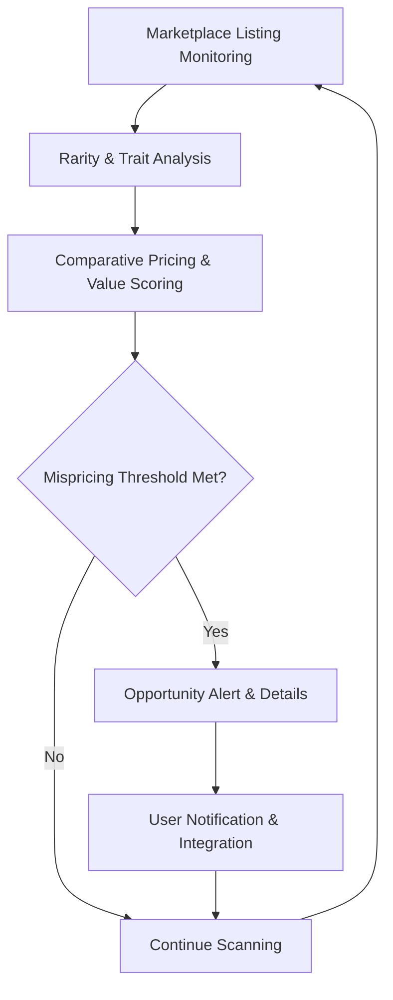

# Mispriced NFT Finder

Deploy Mispriced NFT Finder as a real-time marketplace analysis execution layer for detecting undervalued NFTs based on rarity, floor price discrepancies, trait value, and market momentum across Ethereum, Solana, and major NFT marketplaces.

### Introduction to NFT Value Discovery Tools

NFT markets often have pricing inefficiencies. A **Mispriced NFT Finder** functions as a specialized **marketplace scanning and value assessment engine** that identifies NFTs trading below their perceived fair value based on rarity, traits, and market trends.

Collectors, flippers, and traders use these tools to find bargain opportunities and make data-driven purchasing decisions in secondary markets.

### Inside the System: Core Mechanism

The finder operates as a **multi-marketplace data aggregator and valuation layer**. It analyzes:

- Current listings and floor prices
- Trait rarity and historical sales data
- Collection momentum and volume trends
- Comparative pricing across marketplaces

The engine scores NFTs for mispricing potential and delivers prioritized opportunities with supporting data.

### Target Audience and Practical Use Cases

This execution layer targets:
- NFT flippers seeking undervalued assets
- Collectors building collections at optimal prices
- Traders exploiting marketplace inefficiencies
- Market researchers analyzing pricing dynamics

Common applications include:
- **Floor price vs rarity arbitrage**
- **Trait-specific bargain hunting**
- **Cross-marketplace price discrepancies**
- **Momentum-based opportunity detection**

### Technical Architecture and Operational Logic

A robust Mispriced NFT Finder includes:

- **Marketplace Monitoring Layer**: Real-time listing and sales data from major platforms
- **Rarity & Value Analysis Engine**: Trait scoring and comparative valuation
- **Mispricing Detection Module**: Algorithmic identification of undervalued NFTs
- **Alert & Reporting Hub**: Prioritized opportunities with supporting metrics
- **Historical Database**: Trend analysis for better pricing context

**Operational Logic Flowchart**

### Key Features and Technical Advantages

- **Real-Time Marketplace Scanning**: Instant detection of pricing inefficiencies
- **Trait-Based Valuation**: Rarity-adjusted pricing insights
- **Multi-Marketplace Comparison**: Cross-platform opportunity detection
- **Customizable Filters**: User-defined mispricing criteria
- **Integration Ready**: Webhooks for trading workflows

The system provides data-driven insights beyond simple floor prices for identifying true bargains.

### Where It Fits in the Market: Comparison Table

| Aspect                | Mispriced NFT Finder    | Manual Market Research| Marketplace Tools     | Basic Rarity Tools   |
|-----------------------|-------------------------|-----------------------|-----------------------|----------------------|
| Analysis Depth       | Pricing + rarity       | Deep but slow         | Surface-level         | Rarity only          |
| Speed                | Real-time              | Slow                  | Platform-dependent    | Fast                 |
| Multi-Marketplace    | Cross-platform         | Manual                | Single platform       | Limited              |
| Automation           | Strong alerts          | None                  | Basic                 | Limited              |
| Best Use Case        | Bargain hunting        | Thorough research     | Browsing              | Rarity checks        |
| Customization        | High                   | Full                  | Moderate              | Moderate             |

### Risk Surface and Limitations

Mispriced NFT finding tools have practical limitations:
- **Subjective Value**: "Mispriced" is not always accurate market value
- **Market Volatility**: Pricing can change rapidly after detection
- **Data Lag**: Real-time data may have delays or gaps
- **Liquidity Risk**: Undervalued NFTs may be hard to sell
- **Over-Reliance**: Tools should support, not replace, personal judgment

**Optimization Note**: Cross-verify opportunities with multiple tools, consider broader market trends, and perform manual review for high-value decisions. "Mispriced" is one signal among many in NFT trading.

### Deployment Profile and Getting Started

1. **Tool Selection**: Choose web-based or API solutions with strong marketplace integration.
2. **Basic Usage**: Configure filters for desired traits and pricing thresholds.
3. **Integration**: Connect to trading workflows or notification services.
4. **Workflow**: Combine with liquidity checks and project analysis for complete evaluation.
5. **Advanced Use**: Customize scoring models or set up continuous monitoring.

Open-source and commercial options provide various levels of sophistication.

### Conclusion

The Mispriced NFT Finder serves as a powerful marketplace analysis execution engine for identifying undervalued NFT opportunities. Its value lies in real-time scanning, rarity-adjusted valuation, and actionable insights rather than any absolute pricing guarantee. For collectors and traders who combine it with broader market analysis and due diligence, it provides significant advantages in finding bargain NFTs.

### FAQ

**How accurate are mispriced NFT detections?**  
They highlight potential inefficiencies based on data, but market value is subjective. Always perform additional research before purchasing.

**Does it support Solana and Ethereum NFTs?**  
Yes. Modern tools integrate with major marketplaces on both ecosystems.

**Can it find mispriced NFTs automatically?**  
Yes. Configurable alerts and filters allow automated opportunity detection.

**What are the main limitations?**  
Data delays, subjective value, and the fact that "mispriced" does not guarantee quick profits. Use as one tool in a broader strategy.

**How does it compare to manual market research?**  
Automation provides speed and scale for scanning large numbers of listings, while manual research offers deeper contextual understanding. Best results come from combining both approaches.
